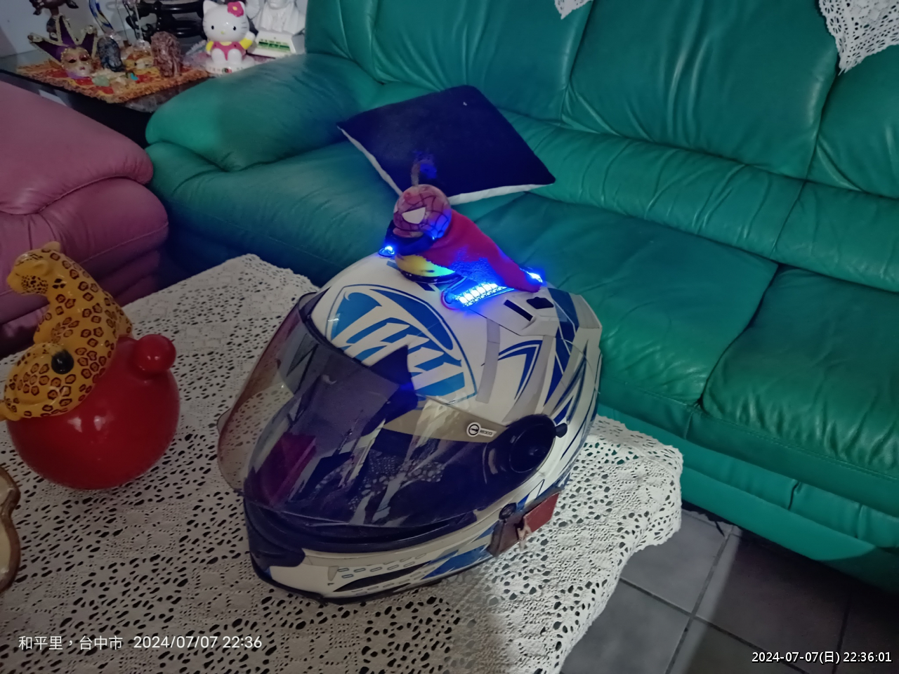
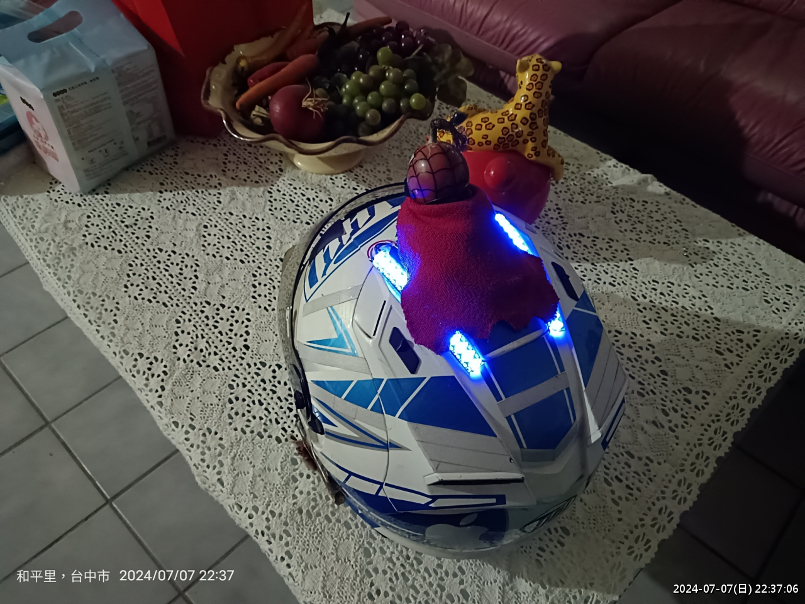
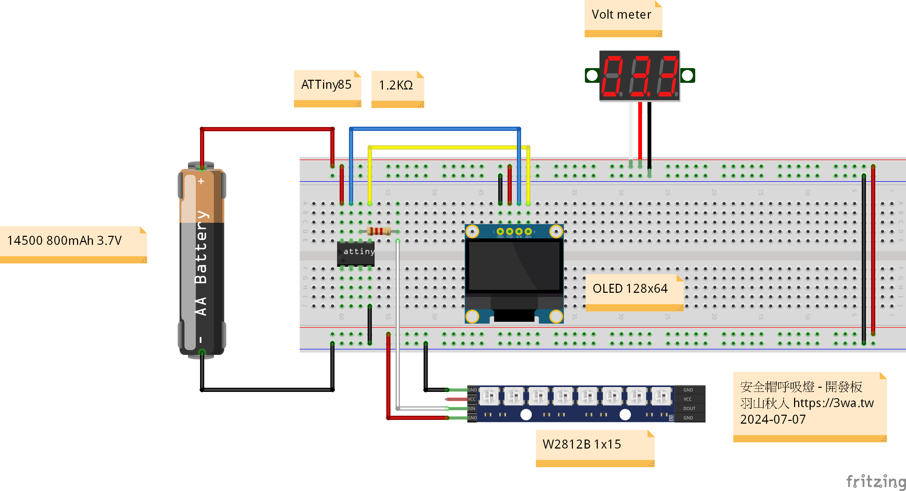
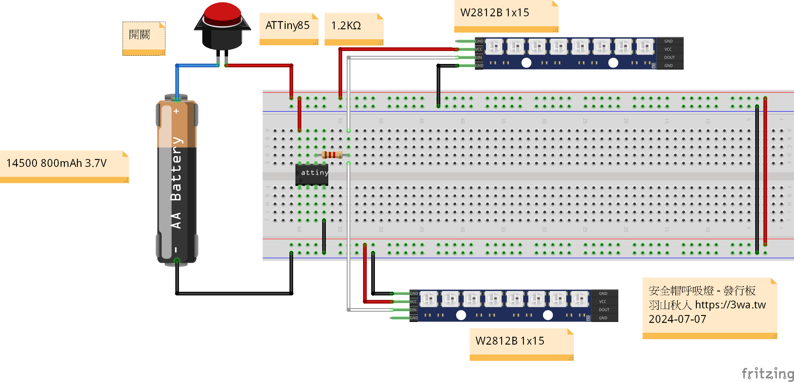

# helmet_rgb_breath_led
安全帽呼吸燈

之前在安全帽上黏的黃色小鴨，如果在夜晚可以發出光芒就太美好了

 

 

<h3>關聯套件：</h3>
<ul>
	<li>1. SystemStatus 可以用來讀出 Attiny VCC 電壓，且不用增加任何電路</li>
	<li>2. TinyWireM、Tiny4kOLED 提供 OLED 顯示文字使用</li>
	<li>3. Adafruit_NeoPixel 提供 W2812B Pixel LED 使用</li>
</ul>

<h3>注意事項：</h3>
ATTiny85 需使用 8mHZ 燒錄至 bootloader

開發模式：偵測 14500 鋰電池剩餘電量，使用 OLED 128x64 液晶面板
將抓到的電池電壓顯示

發行模式：安裝二排 W2812B Pixel LED，可以共用同一組 DI 線

<h3>Reference:</h3>
<ul>
	<li>1. https://github.com/cano64/ArduinoSystemStatus</li>
	<li>2. https://github.com/adafruit/TinyWireM</li>
	<li>3. https://github.com/datacute/Tiny4kOLED</li>
	<li>4. https://github.com/adafruit/Adafruit_NeoPixel</li>
</ul>
